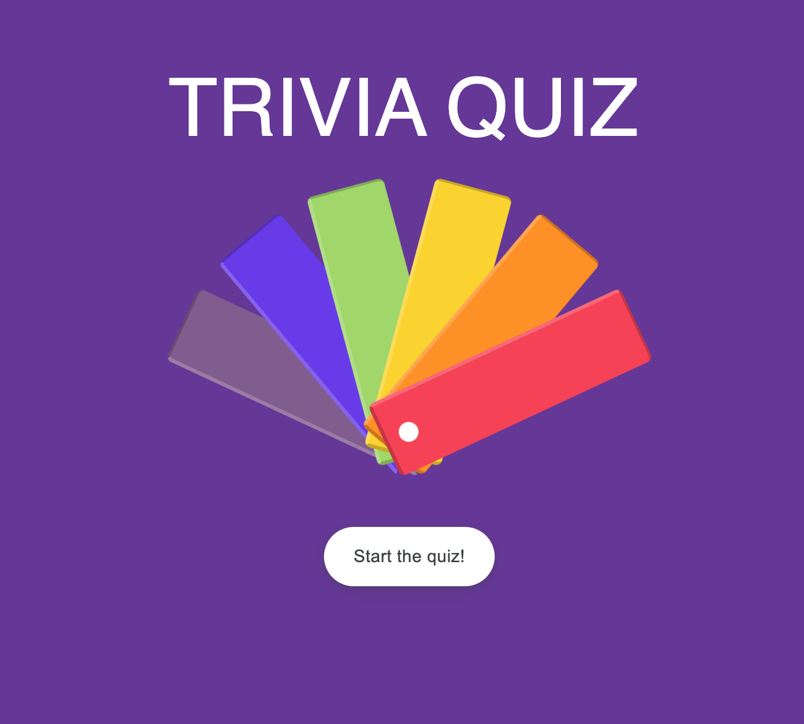
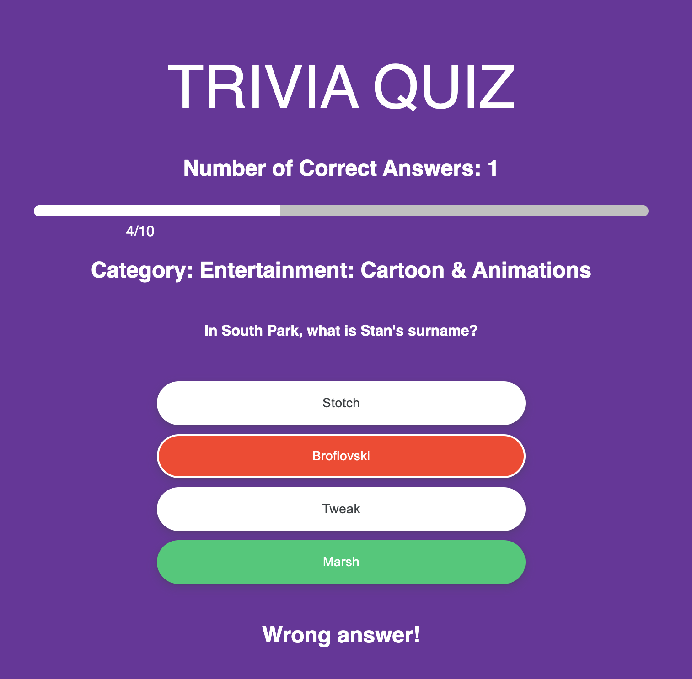

# Trivia Quiz 🏆

Welcome to **Trivia Quiz**! This project is a quiz game that fetches trivia questions from an API based on a randomly chosen category. It's an engaging way to test your knowledge while having fun!

## Overview

**Trivia Quiz** selects a random category and fetches 10 trivia questions from that category. Answer the questions correctly to test your knowledge and challenge yourself.

## Features

- Fetches trivia questions from an API
- Randomly selects a category for questions
- Presents 10 questions to the user
- Allows users to answer questions and provides feedback
- Tracks the number of correct answers

## Upcoming Feature

I'm currently working on a new feature that will enable users to choose their preferred category for the trivia questions. Stay tuned for updates!
